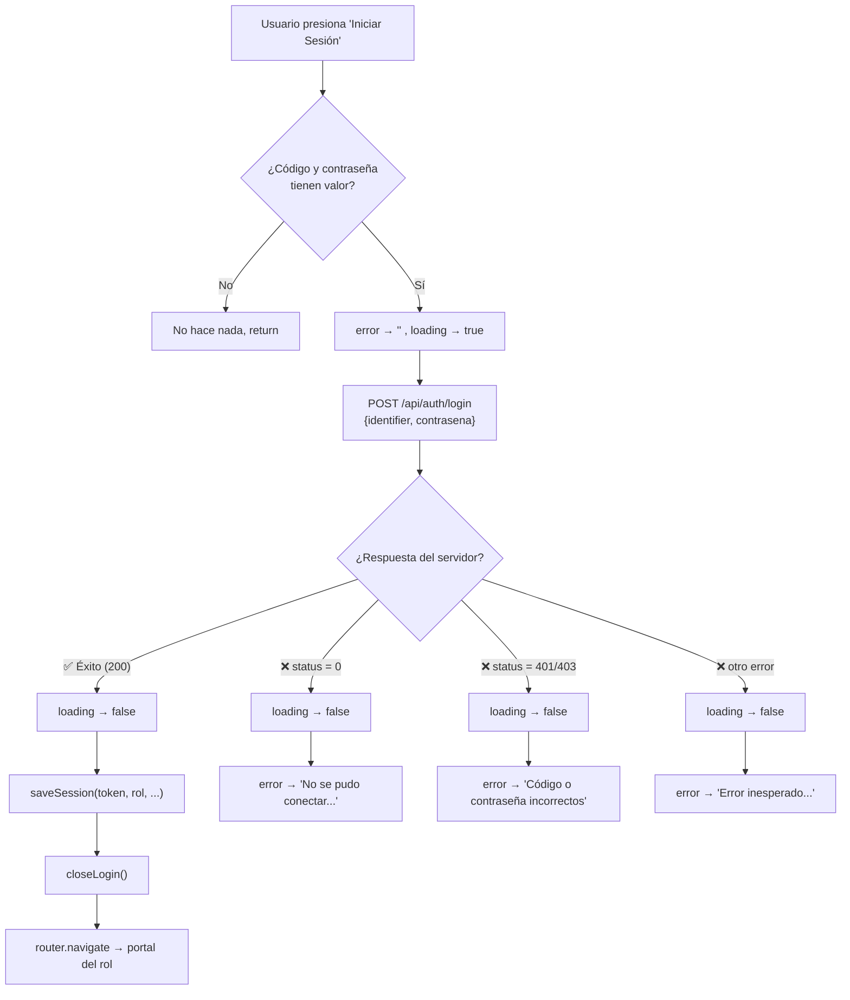
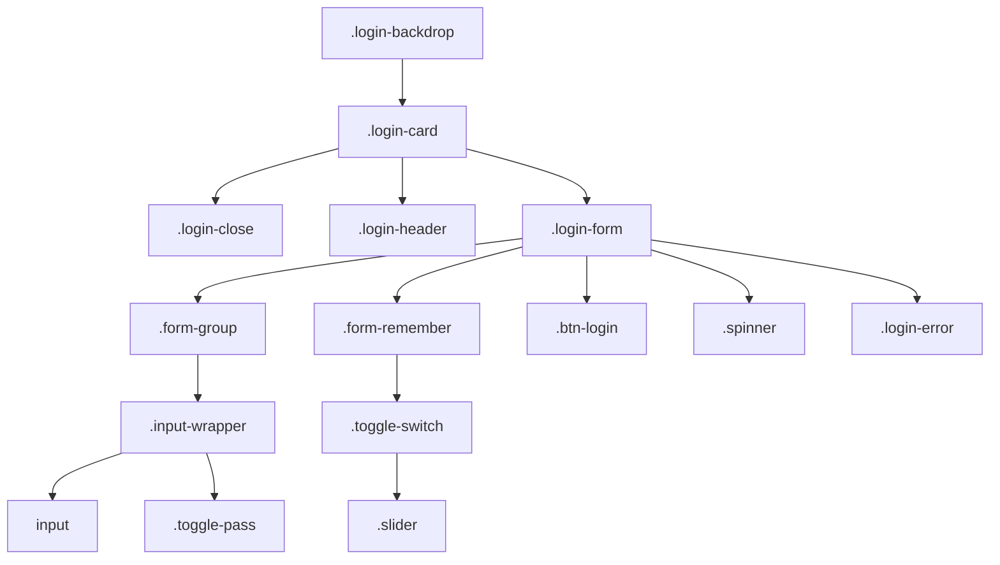
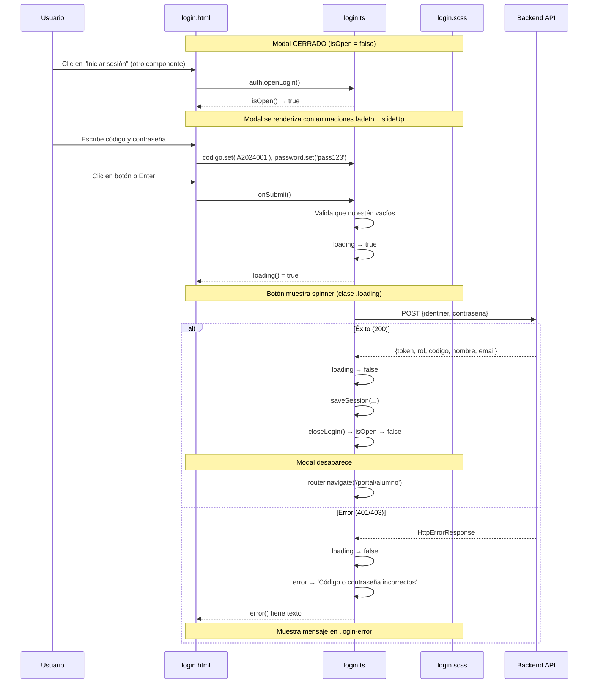

# Documentación — Componente `Login`

> Carpeta: [frontend/src/app/components/login/](file:///c:/Users/USER/Documents/GitHub/Angular/frontend/src/app/components/login)

Este componente implementa el **modal de inicio de sesión** del Portal Académico San Agustín Campus. Está compuesto por 3 archivos:

| Archivo | Rol | Líneas |
|---|---|---|
| [login.ts](file:///c:/Users/USER/Documents/GitHub/Angular/frontend/src/app/components/login/login.ts) | Lógica del componente (TypeScript) | 71 |
| [login.html](file:///c:/Users/USER/Documents/GitHub/Angular/frontend/src/app/components/login/login.html) | Plantilla visual (HTML) | 88 |
| [login.scss](file:///c:/Users/USER/Documents/GitHub/Angular/frontend/src/app/components/login/login.scss) | Estilos (SCSS) | 243 |

---

# PARTE 1 — `login.ts` (Lógica)

## 1.1 Imports (líneas 1–5)

```typescript
import { Component, inject, signal, HostListener } from '@angular/core';  // L1
import { FormsModule } from '@angular/forms';                               // L2
import { HttpClient, HttpErrorResponse } from '@angular/common/http';       // L3
import { Router } from '@angular/router';                                   // L4
import { AuthService } from '../../services/auth.service';                  // L5
```

| Import | De dónde viene | Para qué se usa |
|---|---|---|
| `Component` | `@angular/core` | Decorador que define esta clase como un componente Angular |
| `inject` | `@angular/core` | Función moderna para inyectar dependencias (reemplaza al constructor) |
| `signal` | `@angular/core` | Crea variables reactivas (Angular 16+) |
| `HostListener` | `@angular/core` | Decorador para escuchar eventos del DOM (ej: tecla Escape) |
| `FormsModule` | `@angular/forms` | Habilita directivas de formularios como `ngSubmit` |
| `HttpClient` | `@angular/common/http` | Servicio para hacer peticiones HTTP (POST, GET, etc.) |
| `HttpErrorResponse` | `@angular/common/http` | Tipo que representa un error HTTP (para tipado en el catch) |
| `Router` | `@angular/router` | Servicio para navegar entre rutas programáticamente |
| `AuthService` | Servicio propio | Manejo de sesión y autenticación (ver documento anterior) |

---

## 1.2 Interfaz `LoginResp` (líneas 7–9)

```typescript
interface LoginResp {
  token: string; rol: string; codigo: string; email: string; nombre: string;
}
```

**¿Qué es?** Define la **forma exacta** de la respuesta que el backend envía cuando el login es exitoso.

| Campo | Tipo | Ejemplo |
|---|---|---|
| `token` | `string` | `"eyJhbGciOiJIUzI1NiIs..."` |
| `rol` | `string` | `"alumno"` |
| `codigo` | `string` | `"A2024001"` |
| `email` | `string` | `"juan@escuela.edu"` |
| `nombre` | `string` | `"Juan Pérez"` |

**¿Para qué sirve?** TypeScript usa esta interfaz para:
- Autocompletar las propiedades (`res.token`, `res.rol`, etc.)
- Detectar errores si intentas acceder a un campo que no existe

---

## 1.3 Decorador `@Component` (líneas 11–16)

```typescript
@Component({
  selector: 'app-login',          // L12
  imports: [FormsModule],          // L13
  templateUrl: './login.html',     // L14
  styleUrl: './login.scss',        // L15
})
```

| Propiedad | Qué hace | Detalle |
|---|---|---|
| `selector: 'app-login'` | Define la **etiqueta HTML** para usar este componente | Se usa en otro template como `<app-login />` |
| `imports: [FormsModule]` | Importa módulos que necesita el template | `FormsModule` habilita `(ngSubmit)` en el formulario |
| `templateUrl: './login.html'` | Apunta al archivo HTML del componente | Separa la lógica de la vista |
| `styleUrl: './login.scss'` | Apunta al archivo de estilos | Los estilos son **encapsulados** — solo aplican a este componente |

> [!NOTE]
> Al usar `imports: [FormsModule]` directamente en el componente (en vez de en un módulo), este componente es **standalone** — no necesita declararse en un `NgModule`.

---

## 1.4 Inyección de dependencias (líneas 18–20)

```typescript
private auth   = inject(AuthService);   // L18
private router = inject(Router);        // L19
private http   = inject(HttpClient);    // L20
```

**Línea por línea:**

| Línea | Qué hace | Equivalente con constructor |
|---|---|---|
| L18 | Inyecta el servicio `AuthService` (singleton) para manejar sesión | `constructor(private auth: AuthService)` |
| L19 | Inyecta el `Router` de Angular para navegar entre páginas | `constructor(private router: Router)` |
| L20 | Inyecta `HttpClient` para hacer la petición POST al backend | `constructor(private http: HttpClient)` |

**`inject()` vs Constructor:**
```typescript
// Forma moderna (usada aquí):
private auth = inject(AuthService);

// Forma clásica (equivalente):
constructor(private auth: AuthService) { }
```

Ambas hacen lo mismo. `inject()` es más conciso y permite inyectar fuera del constructor.

> [!TIP]
> `private` significa que estas variables solo se pueden usar dentro de la clase `Login`. Ningún template o componente externo puede acceder a `this.http` o `this.router` directamente.

---

## 1.5 Constante de la API (línea 22)

```typescript
private readonly API = 'http://localhost:8080/api/auth/login';
```

| Palabra clave | Significado |
|---|---|
| `private` | Solo accesible dentro de esta clase |
| `readonly` | No se puede reasignar — si alguien escribe `this.API = '...'`, TypeScript da error |
| Valor | La URL del endpoint de login en el backend (servidor local en puerto 8080) |

---

## 1.6 Señales reactivas — Estado del componente (líneas 24–30)

```typescript
isOpen   = this.auth.isLoginOpen;   // L24 — referencia a la señal del AuthService
codigo   = signal('');              // L25 — texto del input "Código"
password = signal('');              // L26 — texto del input "Contraseña"
remember = signal(false);          // L27 — toggle "Recordar mi código"
showPass = signal(false);          // L28 — mostrar/ocultar contraseña
loading  = signal(false);          // L29 — si la petición HTTP está en curso
error    = signal('');             // L30 — mensaje de error a mostrar
```

**Desglose de cada señal:**

| Señal | Valor inicial | Cambia cuando... | Se lee en el template como... |
|---|---|---|---|
| `isOpen` | `false` | Se llama `auth.openLogin()` o `auth.closeLogin()` | `@if (isOpen())` — controla si el modal es visible |
| `codigo` | `''` (vacío) | El usuario escribe en el input de código | `codigo()` — obtiene el texto actual |
| `password` | `''` (vacío) | El usuario escribe en el input de contraseña | `password()` — obtiene el texto actual |
| `remember` | `false` | El usuario activa/desactiva el toggle | `remember()` — `true` o `false` |
| `showPass` | `false` | El usuario hace clic en el ícono del ojo | `showPass() ? 'text' : 'password'` — cambia tipo de input |
| `loading` | `false` | Se envía el formulario (→ `true`) y cuando responde el servidor (→ `false`) | Muestra spinner o texto del botón |
| `error` | `''` (vacío) | El servidor responde con error | Muestra mensaje de error en rojo |

> [!IMPORTANT]
> **`isOpen`** no crea una nueva señal — es una **referencia directa** a `this.auth.isLoginOpen`. Ambos apuntan al mismo objeto. Si `AuthService` cambia el valor, este componente lo ve automáticamente.

---

## 1.7 Función `onEsc()` — Cerrar con Escape (líneas 32–33)

```typescript
@HostListener('document:keydown.escape')
onEsc() { this.close(); }
```

**Paso a paso:**

1. `@HostListener('document:keydown.escape')` → Angular escucha el evento `keydown` en todo el **documento** y filtra solo la tecla **Escape**.
2. Cuando se presiona Escape → Angular llama automáticamente a `onEsc()`.
3. `onEsc()` simplemente delega al método `close()`.

**Sin `@HostListener` tendrías que hacer:**
```typescript
// Equivalente manual (más verboso):
ngOnInit() {
  document.addEventListener('keydown', (e) => {
    if (e.key === 'Escape') this.close();
  });
}
```

---

## 1.8 Función `close()` — Cerrar el modal (línea 35)

```typescript
close() { this.auth.closeLogin(); }
```

**Paso a paso:**

1. Llama a `this.auth.closeLogin()` del `AuthService`.
2. `closeLogin()` ejecuta `this.isLoginOpen.set(false)`.
3. Como `isOpen` es una referencia a `isLoginOpen`, la señal cambia a `false`.
4. El template evalúa `@if (isOpen())` → ahora es `false` → **el modal desaparece**.

---

## 1.9 Función `onBackdropClick()` — Cerrar al hacer clic fuera (líneas 37–41)

```typescript
onBackdropClick(event: MouseEvent) {
  if ((event.target as HTMLElement).classList.contains('login-backdrop')) {
    this.close();
  }
}
```

**Paso a paso:**

1. **L37** — Recibe el evento de clic como `MouseEvent`.
2. **L38** — `event.target` es el elemento HTML exacto donde se hizo clic.
   - `as HTMLElement` → cast de TypeScript para acceder a `.classList`.
   - `.classList.contains('login-backdrop')` → verifica si el clic fue en el **fondo oscuro** (backdrop), no en la tarjeta blanca.
3. **L39** — Si sí fue en el backdrop → cierra el modal.
4. Si el clic fue en la tarjeta (`.login-card`) → **no pasa nada**, el modal sigue abierto.

**¿Por qué esta verificación?**
Sin ella, cualquier clic dentro del modal lo cerraría, porque la tarjeta está **dentro** del backdrop y los eventos de clic "burbujean" hacia arriba.

```
┌─────────────── login-backdrop (clic aquí → cierra) ───────────────┐
│                                                                     │
│   ┌─────── login-card (clic aquí → NO cierra) ───────┐            │
│   │                                                     │            │
│   │   Formulario, inputs, botones...                   │            │
│   │                                                     │            │
│   └─────────────────────────────────────────────────────┘            │
│                                                                     │
└─────────────────────────────────────────────────────────────────────┘
```

---

## 1.10 Función `onSubmit()` — Enviar formulario (líneas 43–69)

Esta es la función principal del componente. Maneja todo el proceso de login.

### Paso 1: Validación (línea 44)

```typescript
if (!this.codigo() || !this.password()) return;
```

- `this.codigo()` lee el valor actual de la señal `codigo`.
- Si el código o la contraseña están vacíos (`''` es falsy en JS) → **sale de la función** sin hacer nada.
- Esto evita enviar peticiones HTTP con campos vacíos.

### Paso 2: Preparar el estado (líneas 45–46)

```typescript
this.error.set('');        // Limpia cualquier error anterior
this.loading.set(true);    // Activa el estado de carga (spinner en el botón)
```

### Paso 3: Petición HTTP POST (líneas 48–51)

```typescript
this.http.post<LoginResp>(this.API, {
  identifier: this.codigo(),
  contrasena: this.password()
}).subscribe({
```

**Línea por línea:**

| Parte | Qué hace |
|---|---|
| `this.http.post<LoginResp>` | Hace una petición **POST** y le dice a TypeScript que la respuesta será de tipo `LoginResp` |
| `this.API` | La URL destino: `http://localhost:8080/api/auth/login` |
| `{ identifier: ..., contrasena: ... }` | El **body** de la petición — los datos que se envían al backend como JSON |
| `.subscribe({...})` | Se "suscribe" a la respuesta — Angular usa Observables (RxJS), no Promises |

**Lo que se envía al backend:**
```json
{
  "identifier": "A2024001",
  "contrasena": "miPassword123"
}
```

### Paso 4: Respuesta exitosa — `next` (líneas 52–57)

```typescript
next: (res) => {
  this.loading.set(false);                                              // L53
  this.auth.saveSession(res.token, res.rol, res.codigo, res.nombre, res.email);  // L54
  this.auth.closeLogin();                                               // L55
  this.router.navigate([this.auth.getPortalRoute()]);                   // L56
},
```

**Línea por línea:**

| Línea | Qué hace |
|---|---|
| **L53** | Desactiva el spinner — la petición terminó |
| **L54** | Guarda los 5 datos de sesión en `localStorage` usando `AuthService.saveSession()` |
| **L55** | Cierra el modal de login |
| **L56** | Navega al portal correspondiente al rol. Ejemplo: si `rol = 'alumno'` → navega a `/portal/alumno` |

### Paso 5: Error en la petición — `error` (líneas 58–67)

```typescript
error: (err: HttpErrorResponse) => {
  this.loading.set(false);                                    // L59
  if (err.status === 0) {                                     // L60
    this.error.set('No se pudo conectar al servidor.');       // L61
  } else if (err.status === 401 || err.status === 403) {      // L62
    this.error.set('Código o contraseña incorrectos.');       // L63
  } else {                                                     // L64
    this.error.set('Error inesperado. Intenta de nuevo.');    // L65
  }
}
```

**Línea por línea:**

| Línea | Condición | Cuándo ocurre | Mensaje al usuario |
|---|---|---|---|
| L60–61 | `status === 0` | El servidor no está encendido o no hay internet | "No se pudo conectar al servidor." |
| L62–63 | `status === 401` o `403` | Credenciales incorrectas o acceso denegado | "Código o contraseña incorrectos." |
| L64–65 | Cualquier otro error | Error 500 del servidor, timeout, etc. | "Error inesperado. Intenta de nuevo." |

> [!NOTE]
> `err.status === 0` es un caso especial de HTTP — significa que **la petición nunca llegó al servidor** (CORS, red caída, o servidor apagado).

---

### Diagrama del flujo de `onSubmit()`



---

# PARTE 2 — `login.html` (Template)

## 2.1 Condicional principal (línea 1 y 87)

```html
@if (isOpen()) {
  <!-- Todo el modal -->
}
```

- `isOpen()` lee la señal reactiva.
- Si es `true` → renderiza todo el modal.
- Si es `false` → el modal **no existe en el DOM** (no es solo invisible, no está).

---

## 2.2 Backdrop — Fondo oscuro (línea 2)

```html
<div class="login-backdrop" (click)="onBackdropClick($event)">
```

- Es el fondo semitransparente oscuro que cubre toda la pantalla.
- `(click)="onBackdropClick($event)"` → al hacer clic, pasa el evento a `onBackdropClick()` para verificar si fue en el fondo o en la tarjeta.

---

## 2.3 Botón de cerrar (líneas 5–10)

```html
<button class="login-close" (click)="close()">
  <svg><!-- Ícono X --></svg>
</button>
```

- Botón circular en la esquina superior derecha con un ícono de **X** (SVG inline).
- `(click)="close()"` → cierra el modal.

---

## 2.4 Header del modal (líneas 12–16)

```html
<div class="login-header">
  
  <h2>Portal Académico</h2>
  <p>San Agustín Campus</p>
</div>
```

- Muestra el logo, título y subtítulo del portal centrados en la parte superior.

---

## 2.5 Formulario (línea 18)

```html
<form class="login-form" (ngSubmit)="onSubmit()">
```

- `(ngSubmit)="onSubmit()"` → cuando se envía el formulario (presionando Enter o el botón submit), Angular llama a `onSubmit()`.
- `ngSubmit` **previene** automáticamente el comportamiento por defecto del formulario (refrescar la página).

---

## 2.6 Input de Código (líneas 20–31)

```html
<div class="form-group">
  <label for="codigo">Código</label>
  <div class="input-wrapper">
    <svg><!-- Ícono de usuario --></svg>
    <input id="codigo" type="text" placeholder="Ingresa tu código"
      [value]="codigo()" (input)="codigo.set($any($event.target).value)" />
  </div>
</div>
```

**La línea clave es la 28–29:**

| Binding | Dirección | Qué hace |
|---|---|---|
| `[value]="codigo()"` | Señal → Input | El valor del input **siempre** refleja lo que tenga la señal `codigo` |
| `(input)="codigo.set(...)"` | Input → Señal | Cada vez que el usuario escribe, actualiza la señal con el nuevo valor |

**`$any($event.target).value`** — Desglose:
- `$event` → el evento nativo `InputEvent`
- `$event.target` → el elemento `<input>` del DOM
- `$any(...)` → cast de Angular para evitar errores de tipado (TypeScript no sabe que `target` es un `HTMLInputElement`)
- `.value` → el texto actual del input

---

## 2.7 Input de Contraseña (líneas 33–61)

```html
<input id="password" [type]="showPass() ? 'text' : 'password'"
  placeholder="Ingresa tu contraseña"
  [value]="password()" (input)="password.set($any($event.target).value)" />
```

**Diferencia clave:** `[type]="showPass() ? 'text' : 'password'"`

| `showPass()` | Tipo del input | Resultado |
|---|---|---|
| `false` | `password` | Se ven puntos: `••••••••` |
| `true` | `text` | Se ve el texto: `miPassword123` |

### Botón de mostrar/ocultar contraseña (línea 44)

```html
<button type="button" class="toggle-pass" (click)="showPass.update(v => !v)">
```

- `type="button"` → evita que el botón envíe el formulario.
- `showPass.update(v => !v)` → invierte el valor actual: `false → true → false → ...`
- Según el valor, muestra un ícono de **ojo abierto** o **ojo tachado** usando `@if / @else`.

---

## 2.8 Toggle "Recordar mi código" (líneas 63–69)

```html
<div class="form-remember">
  <label class="toggle-switch">
    <input type="checkbox" [checked]="remember()" (change)="remember.update(v => !v)" />
    <span class="slider"></span>
  </label>
  <span>Recordar mi código</span>
</div>
```

- `[checked]="remember()"` → el checkbox está marcado si `remember()` es `true`.
- `(change)="remember.update(v => !v)"` → al cambiar, invierte el valor.
- El `<span class="slider">` se estiliza con CSS para parecer un **toggle switch** en vez de un checkbox estándar.

> [!NOTE]
> Actualmente el toggle se renderiza en la UI pero la funcionalidad de "recordar" (guardar el código para la próxima visita) **no está implementada** en la lógica de `onSubmit()`.

---

## 2.9 Botón de envío (líneas 71–77)

```html
<button type="submit" class="btn-login" [class.loading]="loading()">
  @if (loading()) {
    <span class="spinner"></span>
  } @else {
    Iniciar Sesión
  }
</button>
```

| Estado | `loading()` | Lo que se muestra | Clase CSS |
|---|---|---|---|
| Normal | `false` | Texto: "Iniciar Sesión" | `btn-login` |
| Cargando | `true` | Spinner animado | `btn-login loading` |

- `[class.loading]="loading()"` → agrega la clase CSS `loading` cuando está cargando (deshabilita el hover y pone `cursor: not-allowed`).
- `type="submit"` → al hacer clic, dispara el evento `(ngSubmit)` del formulario.

---

## 2.10 Mensaje de error (líneas 79–81)

```html
@if (error()) {
  <p class="login-error">{{ error() }}</p>
}
```

- Solo se muestra si `error()` tiene texto (string no vacío = truthy).
- `{{ error() }}` → muestra el mensaje de error correspondiente.
- Se estiliza con fondo rosa claro y texto rojo.

---

# PARTE 3 — `login.scss` (Estilos)

## 3.1 Estructura general de los estilos



---

## 3.2 Backdrop — Fondo del modal (líneas 1–16)

```scss
.login-backdrop {
  position: fixed;        // Se posiciona sobre toda la ventana
  inset: 0;               // top: 0; right: 0; bottom: 0; left: 0 (shorthand)
  background: rgba(13, 27, 42, 0.7);  // Azul oscuro con 70% de opacidad
  backdrop-filter: blur(4px);          // Desenfoca lo que está detrás
  display: flex;           // Para centrar la tarjeta
  align-items: center;     // Centrado vertical
  justify-content: center; // Centrado horizontal
  z-index: 1000;           // Asegura que esté por encima de todo
  animation: fadeIn 0.2s ease;  // Aparece con fade-in
}

@keyframes fadeIn {
  from { opacity: 0; }    // Empieza invisible
  to   { opacity: 1; }    // Termina visible
}
```

---

## 3.3 Tarjeta principal (líneas 18–32)

```scss
.login-card {
  background: #ffffff;
  border-radius: 16px;                        // Esquinas redondeadas
  padding: 2.5rem 2rem 2rem;                  // Espaciado interno
  width: 100%;
  max-width: 420px;                            // Ancho máximo
  position: relative;                          // Para posicionar el botón X
  box-shadow: 0 20px 60px rgba(0, 0, 0, 0.3); // Sombra grande y suave
  animation: slideUp 0.25s ease;               // Aparece subiendo
}

@keyframes slideUp {
  from { transform: translateY(24px); opacity: 0; }  // Empieza 24px abajo e invisible
  to   { transform: translateY(0);    opacity: 1; }  // Termina en su posición, visible
}
```

---

## 3.4 Botón cerrar (líneas 34–54)

```scss
.login-close {
  position: absolute;   // Se posiciona respecto a .login-card
  top: 1rem;
  right: 1rem;
  background: #f0f2f5;  // Gris claro
  border: none;
  border-radius: 50%;   // Círculo perfecto
  width: 34px;
  height: 34px;
  cursor: pointer;
  color: #555;
  transition: background 0.2s ease, color 0.2s ease;

  &:hover {
    background: #c1121f; // Rojo al pasar el mouse
    color: #ffffff;      // Ícono blanco
  }
}
```

---

## 3.5 Input wrapper — Contenedor de inputs (líneas 96–142)

```scss
.input-wrapper {
  border: 1.5px solid #dde1e7;    // Borde gris claro
  border-radius: 8px;
  background: #f8f9fa;            // Fondo gris muy claro
  transition: border-color 0.2s ease;

  &:focus-within {                // Cuando el input DENTRO tiene focus:
    border-color: #c1121f;        //   → borde rojo
    background: #ffffff;          //   → fondo blanco
  }
}
```

> [!TIP]
> `:focus-within` es un pseudo-selector CSS que se activa cuando **cualquier hijo** del elemento tiene focus. Esto permite que todo el contenedor reaccione cuando el usuario hace clic en el input, no solo el input mismo.

---

## 3.6 Toggle switch — "Recordar mi código" (líneas 152–189)

```scss
.toggle-switch {
  position: relative;
  width: 38px;
  height: 22px;

  input { opacity: 0; width: 0; height: 0; }  // El checkbox real está OCULTO

  .slider {
    position: absolute;
    inset: 0;
    background: #ccc;             // Gris cuando está apagado
    border-radius: 22px;          // Forma de píldora
    cursor: pointer;

    &::before {                   // El círculo blanco que se desliza
      content: '';
      width: 16px; height: 16px;
      left: 3px; top: 3px;
      background: white;
      border-radius: 50%;
      transition: transform 0.25s ease;
    }
  }

  input:checked + .slider {
    background: #c1121f;          // Rojo cuando está encendido
  }

  input:checked + .slider::before {
    transform: translateX(16px);  // Mueve el círculo a la derecha
  }
}
```

**¿Cómo funciona?**
1. El `<input type="checkbox">` real está oculto (`opacity: 0`).
2. El `.slider` es un elemento visual que simula el switch.
3. El `::before` del slider es la **bolita blanca**.
4. Cuando el checkbox está `:checked`, CSS cambia el color del fondo y mueve la bolita con `translateX`.

---

## 3.7 Botón de login (líneas 192–217)

```scss
.btn-login {
  background-color: #c1121f;  // Rojo institucional
  color: #ffffff;
  border-radius: 8px;
  font-weight: 700;
  transition: background 0.25s ease, transform 0.15s ease;

  &:hover:not(.loading) {     // Solo aplica hover si NO está cargando
    background-color: #a50e19; // Rojo más oscuro
    transform: translateY(-1px); // Sube 1px (efecto de presión)
  }

  &.loading {
    opacity: 0.8;
    cursor: not-allowed;       // Cambia el cursor a "no permitido"
  }
}
```

---

## 3.8 Spinner de carga (líneas 219–230)

```scss
.spinner {
  width: 20px;
  height: 20px;
  border: 2.5px solid rgba(255,255,255,0.35);  // Borde semitransparente
  border-top-color: #ffffff;                     // Solo el borde superior es blanco
  border-radius: 50%;                            // Círculo
  animation: spin 0.7s linear infinite;          // Gira infinitamente
}

@keyframes spin {
  to { transform: rotate(360deg); }  // Rotación completa
}
```

**Truco del spinner:** Al tener 3 bordes semitransparentes y 1 borde blanco opaco, al girar crea la ilusión de un arco que rota.

---

## 3.9 Mensaje de error (líneas 232–242)

```scss
.login-error {
  background: #fff0f0;           // Rosa muy claro
  border: 1px solid #f5c6c6;    // Borde rosa
  border-radius: 8px;
  color: #c1121f;                // Texto rojo
  font-size: 0.82rem;
  font-weight: 500;
  text-align: center;
}
```

---

# PARTE 4 — Flujo completo integrado

## ¿Cómo interactúan los 3 archivos?



---

# PARTE 5 — Paleta de colores usada

| Color | Hex | Uso |
|---|---|---|
| 🔴 Rojo institucional | `#c1121f` | Botón login, bordes focus, toggle activo, errores |
| 🔴 Rojo hover | `#a50e19` | Hover del botón |
| 🔵 Azul oscuro | `#0d1b2a` | Texto principal, títulos |
| ⚪ Blanco | `#ffffff` | Fondo de la tarjeta |
| 🔘 Gris claro | `#f8f9fa` | Fondo de inputs |
| 🔘 Gris borde | `#dde1e7` | Bordes de inputs |
| 🔘 Gris texto | `#555`, `#888` | Texto secundario |
| 🩷 Rosa error | `#fff0f0` | Fondo del mensaje de error |
