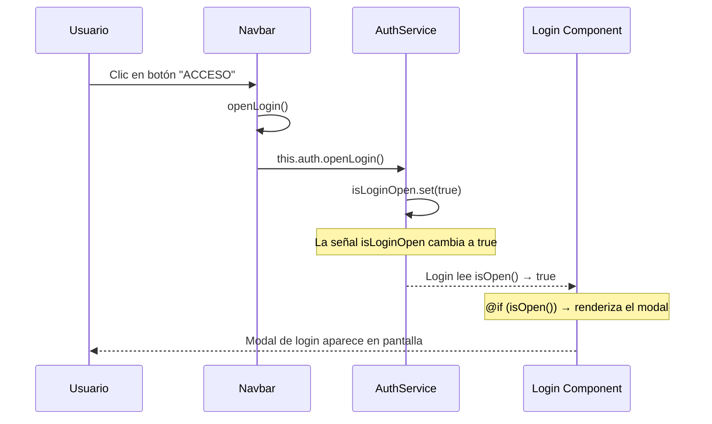
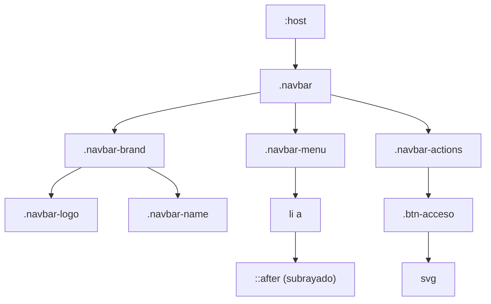
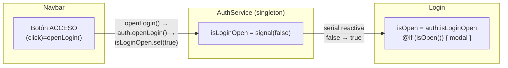
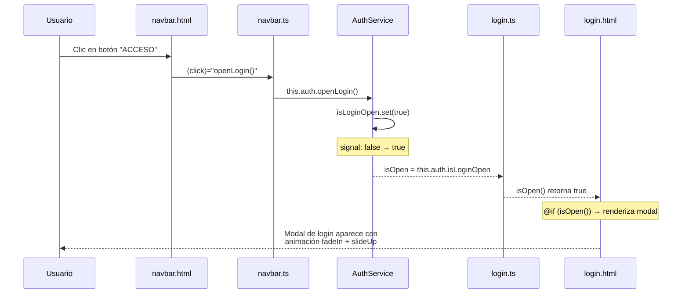

# Documentación — Componente `Navbar`

> Carpeta: [frontend/src/app/components/navbar/](file:///c:/Users/USER/Documents/GitHub/Angular/frontend/src/app/components/navbar)

Este componente implementa la **barra de navegación superior** del Portal Académico San Agustín Campus. Es la barra fija que el usuario ve en la parte superior de la página con el logo, los enlaces de navegación y el botón de acceso (login).

Está compuesto por 3 archivos:

| Archivo | Rol | Líneas |
|---|---|---|
| [navbar.ts](file:///c:/Users/USER/Documents/GitHub/Angular/frontend/src/app/components/navbar/navbar.ts) | Lógica del componente (TypeScript) | 15 |
| [navbar.html](file:///c:/Users/USER/Documents/GitHub/Angular/frontend/src/app/components/navbar/navbar.html) | Plantilla visual (HTML) | 25 |
| [navbar.scss](file:///c:/Users/USER/Documents/GitHub/Angular/frontend/src/app/components/navbar/navbar.scss) | Estilos (SCSS) | 105 |

---

## Estructura visual del Navbar

```
┌──────────────────────────────────────────────────────────────────────┐
│  🏫 San Agustín Campus    NOSOTROS  INFRAESTRUCTURA  ...   [ACCESO] │
│  ↑ logo + nombre          ↑ menú de navegación              ↑ botón │
│  (.navbar-brand)           (.navbar-menu)            (.navbar-actions)│
└──────────────────────────────────────────────────────────────────────┘
```

---

# PARTE 1 — `navbar.ts` (Lógica)

Este es el archivo más simple de los tres. Solo tiene 15 líneas.

## 1.1 Imports (líneas 1–2)

```typescript
import { Component, inject } from '@angular/core';          // L1
import { AuthService } from '../../services/auth.service';   // L2
```

| Import | De dónde viene | Para qué se usa |
|---|---|---|
| `Component` | `@angular/core` | Decorador que define esta clase como un componente Angular |
| `inject` | `@angular/core` | Función moderna para inyectar dependencias sin usar el constructor |
| `AuthService` | Servicio propio | Para abrir el modal de login cuando el usuario hace clic en "ACCESO" |

> [!NOTE]
> A diferencia del componente `Login`, aquí **no** se importa `signal`, `HttpClient`, ni `Router` porque el navbar no maneja estado propio complejo, no hace peticiones HTTP, ni navega programáticamente.

---

## 1.2 Decorador `@Component` (líneas 4–9)

```typescript
@Component({
  selector: 'app-navbar',        // L5
  imports: [],                    // L6
  templateUrl: './navbar.html',   // L7
  styleUrl: './navbar.scss',      // L8
})
```

**Línea por línea:**

| Propiedad | Valor | Qué significa |
|---|---|---|
| `selector` | `'app-navbar'` | Para usar este componente en cualquier template, escribes `<app-navbar />` |
| `imports` | `[]` (vacío) | Este componente no necesita importar ningún módulo adicional (no usa `FormsModule`, `RouterModule`, etc.) |
| `templateUrl` | `'./navbar.html'` | El archivo HTML que define la vista |
| `styleUrl` | `'./navbar.scss'` | El archivo de estilos — encapsulados solo para este componente |

> [!TIP]
> `imports: []` vacío indica que este componente es **standalone** y no depende de ninguna directiva o módulo de Angular en su template. Los enlaces del menú usan `href` nativo de HTML (no `routerLink` de Angular), por eso no necesita `RouterModule`.

---

## 1.3 Clase `Navbar` (líneas 10–14)

```typescript
export class Navbar {                              // L10
  private auth = inject(AuthService);              // L11
                                                    // L12
  openLogin() { this.auth.openLogin(); }           // L13
}                                                   // L14
```

### Línea 10 — `export class Navbar`

- `export` → permite que otros archivos importen esta clase (Angular la necesita para registrar el componente).
- `class Navbar` → la clase que contiene toda la lógica del componente.

### Línea 11 — `private auth = inject(AuthService)`

```typescript
private auth = inject(AuthService);
```

| Parte | Significado |
|---|---|
| `private` | Solo accesible dentro de esta clase. El template HTML **no** puede usar `auth` directamente |
| `auth` | Nombre de la variable que almacena la instancia del servicio |
| `inject(AuthService)` | Le pide a Angular que inyecte la instancia singleton de `AuthService` |

**¿Qué es `AuthService`?** Es el servicio de autenticación (documentado anteriormente) que maneja:
- La señal `isLoginOpen` (controla si el modal de login es visible)
- Los datos de sesión en `localStorage`

Como `AuthService` tiene `providedIn: 'root'`, es un **singleton** — la misma instancia que usa el componente `Login` es la misma que usa el `Navbar`. Por eso cuando el navbar llama a `openLogin()`, el componente Login lo detecta y se muestra.

### Línea 13 — `openLogin()`

```typescript
openLogin() { this.auth.openLogin(); }
```

**Paso a paso de lo que ocurre cuando se ejecuta:**



| Paso | Qué pasa |
|---|---|
| 1 | El usuario hace clic en el botón "ACCESO" en el navbar |
| 2 | El template llama a `openLogin()` del `Navbar` |
| 3 | `openLogin()` delega a `this.auth.openLogin()` del `AuthService` |
| 4 | `AuthService.openLogin()` ejecuta `this.isLoginOpen.set(true)` |
| 5 | La señal reactiva cambia de `false` a `true` |
| 6 | El componente `Login` tiene `isOpen = this.auth.isLoginOpen` — detecta el cambio |
| 7 | En el template del Login, `@if (isOpen())` ahora es `true` → el modal se renderiza |

> [!IMPORTANT]
> El `Navbar` y el `Login` **nunca se comunican directamente**. Se comunican a través del `AuthService` como intermediario. Este es el patrón de **comunicación por servicio** de Angular — un servicio singleton actúa como "puente" entre componentes que no tienen relación padre-hijo.

---

# PARTE 2 — `navbar.html` (Template)

## 2.1 Estructura general

```html
<nav class="navbar">                           <!-- L1: contenedor principal -->
  <div class="navbar-brand">...</div>          <!-- L2-5: logo + nombre -->
  <ul class="navbar-menu">...</ul>             <!-- L7-12: enlaces de navegación -->
  <div class="navbar-actions">...</div>        <!-- L14-23: botón de acceso -->
</nav>
```

El navbar se divide en **3 secciones** dispuestas en fila con Flexbox:

| Sección | Clase CSS | Contenido | Posición |
|---|---|---|---|
| Brand | `.navbar-brand` | Logo + "San Agustín Campus" | Izquierda |
| Menu | `.navbar-menu` | 4 enlaces de navegación | Centro |
| Actions | `.navbar-actions` | Botón "ACCESO" | Derecha |

---

## 2.2 Brand — Logo y nombre (líneas 2–5)

```html
<div class="navbar-brand">
    <!-- L3 -->
  <span class="navbar-name">San Agustín Campus</span>                             <!-- L4 -->
</div>
```

| Línea | Elemento | Qué hace |
|---|---|---|
| L3 | `` | Muestra el logo de la institución. `alt` proporciona texto alternativo para accesibilidad y SEO |
| L4 | `<span>` | Muestra el nombre "San Agustín Campus" al lado del logo |

---

## 2.3 Menu — Enlaces de navegación (líneas 7–12)

```html
<ul class="navbar-menu">
  <li><a href="#nosotros">Nosotros</a></li>                 <!-- L8 -->
  <li><a href="#infraestructura">Infraestructura</a></li>   <!-- L9 -->
  <li><a href="#nivel-educativo">Nivel Educativo</a></li>   <!-- L10 -->
  <li><a href="#deportes">Talleres Deportivos</a></li>      <!-- L11 -->
</ul>
```

| Enlace | `href` | Comportamiento |
|---|---|---|
| Nosotros | `#nosotros` | Scroll a la sección con `id="nosotros"` |
| Infraestructura | `#infraestructura` | Scroll a la sección con `id="infraestructura"` |
| Nivel Educativo | `#nivel-educativo` | Scroll a la sección con `id="nivel-educativo"` |
| Talleres Deportivos | `#deportes` | Scroll a la sección con `id="deportes"` |

> [!NOTE]
> Los enlaces usan `href="#..."` (anclas HTML nativas), **no** `routerLink` de Angular. Esto significa que hacen **scroll suave** a secciones de la misma página en lugar de navegar a rutas diferentes. Por eso no se importa `RouterModule` en el componente.

---

## 2.4 Actions — Botón de acceso (líneas 14–23)

```html
<div class="navbar-actions">
  <button class="btn-acceso" (click)="openLogin()">            <!-- L15 -->
    <svg xmlns="http://www.w3.org/2000/svg" width="16" height="16"
      viewBox="0 0 24 24" fill="none" stroke="currentColor"
      stroke-width="2" stroke-linecap="round" stroke-linejoin="round">
      <path d="M20 21v-2a4 4 0 0 0-4-4H8a4 4 0 0 0-4 4v2" />  <!-- L18: cuerpo -->
      <circle cx="12" cy="7" r="4" />                            <!-- L19: cabeza -->
    </svg>
    ACCESO                                                        <!-- L21 -->
  </button>
</div>
```

### Línea 15 — El botón

```html
<button class="btn-acceso" (click)="openLogin()">
```

| Parte | Significado |
|---|---|
| `class="btn-acceso"` | Clase CSS para estilizar el botón (rojo, con borde redondeado) |
| `(click)="openLogin()"` | **Event binding** de Angular — cuando el usuario hace clic, ejecuta el método `openLogin()` de la clase `Navbar` |

### Líneas 16–20 — Ícono SVG

El SVG dibuja un **ícono de persona** (silueta de usuario):
- `<path d="M20 21v-2a4 4 0 0 0-4-4H8a4 4 0 0 0-4 4v2" />` → el **cuerpo** (forma de hombros)
- `<circle cx="12" cy="7" r="4" />` → la **cabeza** (círculo)

| Atributo SVG | Valor | Significado |
|---|---|---|
| `width` / `height` | `16` | Tamaño de 16x16 píxeles |
| `fill="none"` | — | Sin relleno (solo contorno) |
| `stroke="currentColor"` | — | El color del trazo hereda del color de texto CSS (`color: #ffffff`) |
| `stroke-width="2"` | — | Grosor del trazo: 2px |
| `stroke-linecap="round"` | — | Extremos de línea redondeados |
| `stroke-linejoin="round"` | — | Uniones de línea redondeadas |

### Línea 21 — Texto del botón

```html
ACCESO
```

Texto en mayúsculas que aparece al lado del ícono.

---

# PARTE 3 — `navbar.scss` (Estilos)

## 3.1 Estructura de los estilos



---

## 3.2 `:host` — El componente como elemento (líneas 1–3)

```scss
:host {
  display: block;
}
```

| Qué es | Explicación |
|---|---|
| `:host` | Pseudo-selector especial de Angular que se refiere al **elemento host** del componente, es decir `<app-navbar>` |
| `display: block` | Por defecto, un componente Angular es `display: inline`. Esto lo convierte en **bloque** para que ocupe todo el ancho disponible |

**Sin `display: block`:**
```html
<!-- <app-navbar> se comportaría como un <span> — no ocupa ancho completo -->
```

**Con `display: block`:**
```html
<!-- <app-navbar> se comporta como un <div> — ocupa el 100% del ancho -->
```

---

## 3.3 `.navbar` — Contenedor principal (líneas 5–14)

```scss
.navbar {
  background-color: #0d1b2a;    // Azul oscuro (casi negro)
  display: flex;                  // Flexbox para disponer los 3 hijos en fila
  align-items: center;           // Centrado vertical de todos los elementos
  justify-content: space-between; // Distribuye: brand ← espacio → menu ← espacio → actions
  padding: 0.6rem 2.5rem;       // Padding: 0.6rem arriba/abajo, 2.5rem izq/der
  position: sticky;              // Se "pega" al tope al hacer scroll
  top: 0;                        // Se pega a 0px del tope
  z-index: 1000;                 // Asegura que esté por encima de otros elementos
  box-shadow: 0 2px 12px rgba(0, 0, 0, 0.4); // Sombra inferior sutil
}
```

**Desglose de propiedades clave:**

| Propiedad | Valor | Efecto visual |
|---|---|---|
| `position: sticky` + `top: 0` | — | El navbar se queda fijo en la parte superior cuando el usuario hace scroll hacia abajo. A diferencia de `fixed`, `sticky` respeta su posición original en el flujo del documento |
| `z-index: 1000` | — | Se asegura que el navbar esté por encima de cualquier otro contenido al hacer scroll. Es el mismo z-index que el modal de login, pero como el modal usa `fixed` y aparece después, se sobrepone correctamente |
| `justify-content: space-between` | — | Pone el máximo espacio posible entre los 3 hijos (brand, menu, actions) |

**Visualización del Flexbox:**

```
┌─────────────────────────────────────────────────────────┐
│ [brand]          ←  espacio  →  [menu]  ← espacio → [actions] │
│ ←──────────── justify-content: space-between ──────────→│
└─────────────────────────────────────────────────────────┘
```

---

## 3.4 `.navbar-brand` — Logo y nombre (líneas 16–34)

```scss
.navbar-brand {
  display: flex;            // Flexbox para poner logo e ícono en fila
  align-items: center;      // Centrado vertical
  gap: 0.75rem;             // Espacio de 0.75rem entre logo y texto
  text-decoration: none;    // Sin subrayado (por si fuera un <a>)

  .navbar-logo {
    height: 48px;           // Altura fija del logo
    width: auto;            // El ancho se ajusta proporcionalmente
  }

  .navbar-name {
    color: #ffffff;          // Texto blanco
    font-size: 1.15rem;     // Tamaño del texto
    font-weight: 700;       // Negrita
    letter-spacing: 0.3px;  // Ligero espaciado entre letras
    white-space: nowrap;     // Evita que el texto se corte en dos líneas
  }
}
```

> [!TIP]
> `white-space: nowrap` es importante para el nombre de la institución — garantiza que "San Agustín Campus" siempre aparezca en una sola línea, sin importar el ancho de la pantalla.

---

## 3.5 `.navbar-menu` — Enlaces de navegación (líneas 36–72)

```scss
.navbar-menu {
  display: flex;        // Flexbox horizontal para los <li>
  list-style: none;     // Elimina las viñetas (bullets) de la lista
  margin: 0;            // Elimina el margen por defecto del <ul>
  padding: 0;           // Elimina el padding por defecto del <ul>
  gap: 2.5rem;          // 2.5rem de espacio entre cada enlace
```

### Los enlaces (`li a`) — Líneas 43–71

```scss
  li a {
    color: #e0e0e0;              // Gris claro (no blanco puro)
    text-decoration: none;       // Sin subrayado
    font-size: 0.82rem;          // Texto pequeño
    font-weight: 600;            // Semi-negrita
    letter-spacing: 0.8px;       // Espaciado entre letras
    text-transform: uppercase;   // TODO EN MAYÚSCULAS
    transition: color 0.25s ease; // Transición suave del color
    position: relative;           // Para posicionar el ::after
```

### El subrayado animado (`::after`) — Líneas 53–62

```scss
    &::after {
      content: '';                    // Crea un pseudo-elemento vacío
      position: absolute;            // Posición absoluta respecto al <a>
      bottom: -4px;                   // 4px debajo del texto
      left: 0;                        // Empieza desde la izquierda
      width: 0;                       // Ancho inicial: 0 (invisible)
      height: 2px;                    // Grosor de la línea: 2px
      background-color: #c1121f;     // Color rojo institucional
      transition: width 0.25s ease;  // Animación suave del ancho
    }
```

### El efecto hover — Líneas 64–70

```scss
    &:hover {
      color: #ffffff;    // El texto cambia de gris a blanco

      &::after {
        width: 100%;     // La línea roja crece de 0 a 100%
      }
    }
```

**¿Cómo funciona el subrayado animado?**

Estado normal:
```
  NOSOTROS
             ← ::after tiene width: 0 (invisible)
```

Al pasar el mouse (hover):
```
  NOSOTROS
  ────────   ← ::after crece a width: 100% (línea roja)
```

La transición `width 0.25s ease` hace que la línea **crezca suavemente** de izquierda a derecha en 0.25 segundos.

> [!TIP]
> Este es un patrón CSS muy popular para menús de navegación. Se usa un `::after` con `width: 0` que crece a `width: 100%` en hover, en vez de usar `text-decoration: underline` que no es animable.

---

## 3.6 `.btn-acceso` — Botón de acceso (líneas 74–103)

```scss
.navbar-actions {
  .btn-acceso {
    background-color: #c1121f;   // Rojo institucional
    color: #ffffff;               // Texto blanco
    border: none;                 // Sin borde
    padding: 0.5rem 1.3rem;     // Padding: 0.5rem vertical, 1.3rem horizontal
    border-radius: 5px;          // Esquinas ligeramente redondeadas
    font-size: 0.82rem;          // Mismo tamaño que los enlaces del menú
    font-weight: 700;            // Negrita
    letter-spacing: 1.2px;       // Espaciado amplio entre letras (efecto "ACCESO")
    cursor: pointer;              // Cambia el cursor a mano
    display: flex;                // Flexbox para alinear ícono + texto
    align-items: center;
    gap: 0.45rem;                // Espacio entre ícono SVG y texto "ACCESO"
    transition: background-color 0.25s ease, transform 0.15s ease;
```

### Ícono SVG dentro del botón (líneas 90–92)

```scss
    svg {
      flex-shrink: 0;    // Evita que el ícono se comprima si falta espacio
    }
```

`flex-shrink: 0` garantiza que el ícono SVG mantenga sus 16x16px sin importar el ancho disponible.

### Hover del botón (líneas 94–97)

```scss
    &:hover {
      background-color: #a00f19;      // Rojo más oscuro
      transform: translateY(-1px);    // Sube 1px (efecto de "elevación")
    }
```

| Propiedad | Efecto |
|---|---|
| `background-color: #a00f19` | El botón se oscurece ligeramente al pasar el mouse |
| `transform: translateY(-1px)` | El botón "sube" 1 píxel, dando una sensación de que se levanta |

### Active del botón (líneas 99–101)

```scss
    &:active {
      transform: translateY(0);    // Vuelve a su posición original
    }
```

Cuando el usuario **presiona** el botón (clic sostenido), el botón regresa a su posición original, creando un efecto de "presión":

| Estado | `translateY` | Sensación |
|---|---|---|
| Normal | `0` | En reposo |
| Hover | `-1px` | Se eleva |
| Active (clic) | `0` | Se presiona hacia abajo |

---

# PARTE 4 — Conexión con otros componentes

## ¿Cómo se conecta el Navbar con el Login?



**Puntos clave:**

1. El `Navbar` no tiene ninguna referencia directa al componente `Login`.
2. La comunicación se da a través del `AuthService` compartido (singleton).
3. El `Navbar` solo **escribe** en la señal (`set(true)`).
4. El `Login` solo **lee** la señal (`isOpen()`).
5. Angular detecta el cambio en la señal y actualiza automáticamente la vista del Login.

---

## Flujo completo: desde el clic hasta el modal



---

# PARTE 5 — Resumen de todo el componente

## Resumen de `navbar.ts`

| Elemento | Tipo | Descripción |
|---|---|---|
| `auth` | Dependencia inyectada | Instancia singleton de `AuthService` |
| `openLogin()` | Método público | Abre el modal de login delegando a `AuthService` |

## Resumen de `navbar.html`

| Sección | Elemento | Funcionalidad |
|---|---|---|
| `.navbar-brand` | Logo + texto | Identidad visual de la institución |
| `.navbar-menu` | 4 enlaces `<a>` | Navegación por anclas a secciones de la página |
| `.navbar-actions` | Botón "ACCESO" | Dispara `openLogin()` al hacer clic |

## Resumen de `navbar.scss`

| Clase | Propiedades clave | Efecto visual |
|---|---|---|
| `:host` | `display: block` | El componente ocupa todo el ancho |
| `.navbar` | `sticky`, `flex`, `z-index: 1000` | Barra fija al tope con sombra |
| `.navbar-brand` | `flex`, `gap` | Logo y nombre alineados horizontalmente |
| `.navbar-menu li a` | `uppercase`, `::after` animado | Links con subrayado rojo al hover |
| `.btn-acceso` | `background: #c1121f`, `translateY` | Botón rojo con efecto de elevación |

## Paleta de colores

| Color | Hex | Dónde se usa |
|---|---|---|
| 🔵 Azul oscuro | `#0d1b2a` | Fondo del navbar |
| ⚪ Blanco | `#ffffff` | Texto del nombre, hover de enlaces |
| 🔘 Gris claro | `#e0e0e0` | Color normal de los enlaces |
| 🔴 Rojo institucional | `#c1121f` | Botón ACCESO, subrayado hover |
| 🔴 Rojo oscuro (hover) | `#a00f19` | Botón ACCESO al pasar el mouse |
